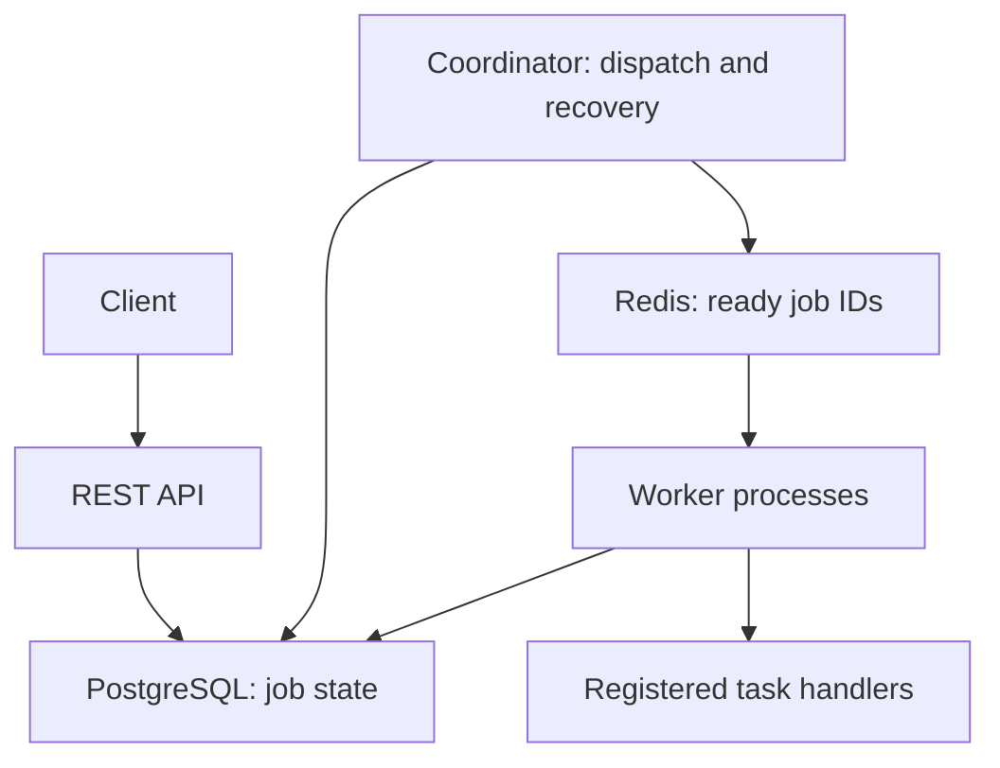

# Distributed Job System

## 1. Overview

Distributed Job System is a backend service that accepts jobs through an HTTP API, executes them asynchronously across independent worker processes, and stores their status and results. Failed jobs can retry automatically, and jobs interrupted by a worker crash can be recovered by another worker.

The project demonstrates API design, database transactions, queue coordination, concurrency, failure recovery, and containerized deployment. The main engineering work is the job infrastructure; individual task implementations should stay simple.

This document describes a proposed design, not an existing implementation or a claim of measured performance. Implementation milestones separate a small working prototype from the complete reliability requirements.

## 2. Goals and scope

### Core goals

- Accept jobs without making clients wait for task execution.
- Run multiple workers concurrently and distribute available work among them.
- Persist job inputs, lifecycle state, attempts, errors, and results.
- Retry eligible failures with bounded exponential backoff.
- Detect abandoned work and recover it after a worker crash.
- Prevent stale workers from overwriting the result of a newer attempt.
- Start the application locally with Docker Compose.
- Demonstrate reliability through repeatable failure scenarios and meaningful tests.

### Initial scope

The first usable version is a single-user, local application with a REST API, a fixed registry of trusted task handlers, PostgreSQL, Redis, and independently scalable workers. An interactive API documentation page and command-line examples are sufficient interfaces.

Implement the queue coordination and worker lifecycle directly rather than delegating them to Celery or another complete job framework. Using libraries for HTTP, database access, validation, and Redis communication is expected.

### Out of scope for the initial version

- Arbitrary user-submitted code, shell commands, or dynamically imported functions.
- Multi-tenant accounts, billing, and a public production deployment.
- Exactly-once execution or guaranteed exactly-once external side effects.
- Workflow graphs, dependent jobs, cron scheduling, and multi-region operation.
- A sophisticated frontend, Kubernetes, or automatic infrastructure scaling.

## 3. Technology choices

| Component | Proposed technology | Responsibility |
| --- | --- | --- |
| API | Python and FastAPI | Validate requests and expose job data |
| Durable storage | PostgreSQL | Store authoritative job state, attempts, and results |
| Queue | Redis | Distribute ready job IDs to workers |
| Database access | SQLAlchemy and a PostgreSQL driver | Execute queries and transactions |
| Schema migrations | Alembic | Apply versioned database changes |
| Task execution | Python worker processes | Claim and execute registered handlers |
| Local deployment | Docker Compose | Run services and persistent volumes |
| Tests | pytest | Verify lifecycle behavior and failure recovery |

Pin dependency versions when implementing the project. Specific package versions are not part of this specification.

### Why PostgreSQL and Redis?

PostgreSQL holds the durable record of what must happen and what has happened. Redis provides a lightweight mechanism for handing ready job IDs to waiting workers. Redis messages are notifications that work may be available; a worker must still claim the corresponding PostgreSQL row before executing anything.

Using both introduces a coordination problem: a database commit and a queue write cannot be assumed to succeed together. The dispatcher described below addresses this by repeatedly discovering unfinished, eligible work in PostgreSQL. Redis queue contents can therefore be reconstructed after loss.

A PostgreSQL-only queue would also be a valid design. This project deliberately includes Redis to explore coordination between services, without assuming Redis is necessary for every background job system.

## 4. Architecture



### Services

- **API:** Validates submissions, commits job records, and serves status, result, and attempt queries.
- **Coordinator:** Publishes eligible job IDs to Redis, schedules due retries, and recovers expired attempts. One coordinator instance is sufficient initially.
- **Workers:** Consume IDs, atomically claim eligible jobs, execute handlers, and record outcomes. Start with one active task per worker process.
- **PostgreSQL:** Remains authoritative even when queue messages are missing, duplicated, or stale.
- **Redis:** Holds a shared ready queue. An initial implementation may use a Redis list with a blocking pop; reliable recovery comes from PostgreSQL reconciliation, not from the pop operation itself.

### Normal execution

1. The client submits a registered task type and validated input.
2. The API commits a `queued` job and returns `202 Accepted` with its ID.
3. The coordinator discovers the eligible job and publishes its ID to Redis.
4. A worker receives the ID and atomically claims the job in PostgreSQL.
5. The worker creates an attempt, changes the job to `running`, and executes the handler outside the claim transaction.
6. The worker periodically renews its ownership lease while execution continues.
7. On success, it commits the result and changes the job to `completed`, provided it still owns the current attempt.
8. The client retrieves the result through the API.

## 5. Supported tasks

Start with these small, deterministic handlers:

| Task | Example input | Result | Purpose |
| --- | --- | --- | --- |
| `sleep` | `{"seconds": 5}` | Requested duration | Observe concurrency and simulate slow work |
| `text_stats` | `{"text": "hello world"}` | Character and whitespace-delimited word counts | Demonstrate useful processing without file storage |
| `fail_until_attempt` | `{"succeed_on_attempt": 3}` | Success on the specified attempt | Demonstrate retries and attempt history |

`fail_until_attempt` uses the persisted attempt number, including the first attempt as number 1. It raises a controlled retryable error before the specified attempt. Keep this handler explicitly labeled as a development/demo task.

Each registered handler defines an input schema and returns a JSON-serializable result. Unknown task types and invalid inputs must be rejected before creating a job. Set input size, result size, duration, and retry limits.

Later tasks may include image resizing, file hashing, report generation, and webhook delivery. File tasks require a separate storage design; real external actions require task-specific duplicate handling.

## 6. Job lifecycle

| State | Meaning |
| --- | --- |
| `queued` | Accepted and eligible for its first execution |
| `running` | Claimed by a worker with a current attempt and lease |
| `retrying` | Waiting until its next permitted execution time |
| `completed` | Finished successfully; terminal |
| `failed` | Permanently failed or exhausted its attempt limit; terminal |

Allowed transitions:

- `queued → running`
- `running → completed`
- `running → retrying` after an eligible failure, execution timeout, or expired lease
- `running → failed` after a permanent failure or exhausted attempt limit
- `retrying → running` once its retry time arrives and a worker claims it

Terminal jobs must not be executed again because of stale queue messages. Manual replay, if added later, creates a new job linked to the original rather than rewriting its history.

## 7. Data model

### `jobs`

| Field | Purpose |
| --- | --- |
| `id` | UUID primary key |
| `task_type` | Registered handler name |
| `input` | Validated JSON payload |
| `status` | Current lifecycle state |
| `result` | JSON result, nullable until completion |
| `last_error_code`, `last_error_message` | Latest sanitized failure information |
| `attempt_count` | Number of attempts started |
| `max_attempts` | Total permitted attempts, including the first |
| `timeout_seconds` | Maximum duration of each attempt |
| `available_at` | Earliest time the job may be claimed |
| `next_dispatch_at` | Earliest time the coordinator should publish another notification |
| `current_attempt_id` | Ownership token for the active attempt |
| `worker_id` | Current owning worker, nullable |
| `lease_expires_at` | Deadline for the current worker to renew ownership |
| `created_at`, `updated_at`, `finished_at` | Lifecycle timestamps |

### `job_attempts`

Store one row per attempt with an ID, job ID, attempt number, worker ID, start/end timestamps, execution deadline, outcome, and error details. Outcomes should distinguish success, handler error, timeout, and worker loss.

Create a unique constraint on `(job_id, attempt_number)` and a foreign key to `jobs`. Index job listing and coordinator queries, including eligibility timestamps and running lease expiration. Use timezone-aware timestamps in UTC and database time for ownership decisions.

Job state changes and corresponding attempt updates must commit in the same transaction.

## 8. HTTP API

| Method | Endpoint | Behavior |
| --- | --- | --- |
| `POST` | `/jobs` | Submit a job; return `202 Accepted` |
| `GET` | `/jobs/{id}` | Retrieve state, result, and latest error |
| `GET` | `/jobs` | List jobs with pagination and optional status/task filters |
| `GET` | `/jobs/{id}/attempts` | Retrieve ordered execution history |
| `GET` | `/health/live` | Report that the API process is responding |
| `GET` | `/health/ready` | Report whether PostgreSQL is available for API operations |

### Submission example

```http
POST /jobs
Content-Type: application/json

{
  "task_type": "text_stats",
  "input": {"text": "hello world"},
  "max_attempts": 3,
  "timeout_seconds": 30
}
```

```json
{
  "id": "2e0ead78-4d5d-4cff-a350-3ce609a6a9df",
  "status": "queued",
  "status_url": "/jobs/2e0ead78-4d5d-4cff-a350-3ce609a6a9df"
}
```

The response should also include a `Location` header pointing to the job resource. Retrieval of a completed job includes:

```json
{
  "id": "2e0ead78-4d5d-4cff-a350-3ce609a6a9df",
  "task_type": "text_stats",
  "status": "completed",
  "attempt_count": 1,
  "result": {"characters": 11, "words": 2},
  "last_error": null
}
```

Return `404` for unknown IDs, `422` for invalid task inputs/options, and `503` when durable submission is unavailable. Use a consistent error envelope with an error code and readable message. Paginated lists must use stable ordering and a bounded page size.

A Redis outage does not prevent durable acceptance while PostgreSQL is available; accepted jobs remain queued until dispatch resumes. Report Redis degradation in operational health information so acceptance is not confused with active processing.

Job deletion and cancellation are deferred. Removing a record is not equivalent to stopping an executing task.

## 9. Reliability requirements

### Durable acceptance and queue reconciliation

Return `202` only after the PostgreSQL insert commits. The coordinator periodically scans nonterminal jobs that are eligible and due for notification.

After a successful Redis publish, advance `next_dispatch_at` by a configurable redispatch interval. A publish failure must leave the job eligible for a later scan. A crash between publishing and updating PostgreSQL may create duplicate notifications, which workers must tolerate. If Redis loses a notification after publication, a later scan republishes the still-unclaimed job.

This approach deliberately allows repeated notifications and extra database checks in exchange for a straightforward recovery model. Publish in bounded batches and avoid tight loops during outages. Strict FIFO execution order is not guaranteed.

### Atomic claims and ownership

Receiving a queue message does not grant ownership. In a short database transaction, a worker must verify eligibility, claim the job, increment its attempt count, and create its attempt record. Use row locking or a conditional update so competing workers cannot both claim the same eligible state.

Every claim gets a new attempt ID. Heartbeats, result commits, and failure updates must match the current attempt ID and require an unexpired lease. A stale worker must not renew an expired lease or overwrite a newer attempt's state.

Do not hold a database transaction open while executing the task. Expired attempts are recovered by the coordinator under the same ownership checks used by worker updates.

### Retries

Use a default of three total attempts: one initial execution and at most two retries. Classify failures explicitly:

- Retryable: controlled transient errors, worker loss, and timeouts within the configured policy.
- Permanent: invalid task semantics or a handler-declared nonretryable error.

For failed attempt number `n`, calculate the next delay as:

```text
delay = min(base_delay × 2^(n - 1), max_delay) + bounded_random_jitter
```

Suggested initial values are a 5-second base, 60-second cap, and 0–1 second jitter. Persist the chosen `available_at` value. A retrying job must not be claimed early, even if Redis contains an old message for it.

### Worker crashes, leases, and timeouts

Suggested development defaults:

| Setting | Default |
| --- | --- |
| Heartbeat interval | 5 seconds |
| Lease duration | 30 seconds |
| Coordinator scan interval | 2 seconds |
| Redispatch interval | 30 seconds |
| Per-attempt execution timeout | 60 seconds |

An execution deadline is separate from a lease: heartbeats must not let a hung task run forever. The worker supervisor should execute handlers in a child process so it can continue heartbeats and terminate an overlong task. On ownership loss, stop the child as soon as possible and reject any later result.

When an expired lease is detected, close the old attempt as worker-lost and either schedule a retry or mark the job failed. Use capped connection-retry delays when dependencies are unavailable.

On graceful shutdown, stop accepting new work, allow a bounded period for the current task to finish, then terminate it if necessary. Unfinished work must remain recoverable after shutdown.

### Delivery guarantees and limitations

The design targets at-least-once execution attempts while PostgreSQL remains durable and services eventually recover. A job may execute more than once, and it may terminate as failed after exhausting its attempt budget. Successful completion is not guaranteed for every accepted job.

Only one attempt may hold valid database ownership at a time. During a partition or delayed process termination, an expired worker may still physically execute code. Attempt tokens protect database state; they cannot undo an email, webhook, or other external side effect.

Start with repeatable tasks. Future side-effecting tasks must use application-specific idempotency, such as a stable job ID accepted by the destination. Request deduplication using an `Idempotency-Key` header is an optional later API feature; without it, resubmitting a POST can create a second job.

## 10. Operations and deployment

Docker Compose should define `api`, `worker`, `coordinator`, `postgres`, and `redis` services. Application services may share one image with different startup commands. Avoid a fixed worker container name so the service can scale.

```bash
docker compose up --build --scale worker=3
```

Provide health checks, named data volumes, an explicit migration command, and an `.env.example` containing nonsecret examples. Keep real credentials out of source control. Application processes must handle temporary dependency failures after startup, not only wait for initial health checks.

Bind the local API to localhost by default and keep database services on the internal Compose network unless development access is explicitly needed. Authentication and request throttling become requirements before any public deployment.

Emit structured logs with service name, worker ID, job ID, attempt ID, event, and duration where relevant. Do not log full job payloads by default. Record queue wait time, execution duration, completed/failed attempts, retries, and recovered leases. A metrics endpoint and dashboard may follow once lifecycle correctness is established.

## 11. Acceptance criteria

| Scenario | Required outcome |
| --- | --- |
| Normal submission | API returns an ID before execution finishes; result becomes retrievable |
| Invalid submission | API rejects it without creating a job |
| Concurrent processing | Three workers execute separate eligible jobs concurrently |
| Duplicate notifications | A running or terminal job is not claimed again from a stale message |
| Controlled transient failure | Job retries after its delay and retains ordered attempt history |
| Permanent failure | Job becomes failed without unnecessary retries |
| Attempt exhaustion | Job stops after the configured total number of attempts |
| Worker killed during a task | Expired ownership is detected and work retries or fails according to budget |
| Timeout | Child execution is stopped and a timeout outcome is recorded |
| Stale worker result | Database rejects a result from an expired or superseded attempt |
| Redis unavailable or queue cleared | Accepted jobs remain durable and resume through reconciliation |
| PostgreSQL unavailable | New submissions are not acknowledged as durably accepted |
| Service restart | Persisted job state and history survive; unfinished jobs remain recoverable |

Use unit tests for validation, retry calculations, and transition rules. Use integration tests with real PostgreSQL and Redis for atomic claims, duplicate messages, and recovery. Keep failure demonstrations repeatable with scripts or documented commands.

Benchmark a fixed batch of sleep jobs using one and three workers. Record hardware, configuration, wall-clock time, queue delay, and outcomes. Treat the result as an I/O-wait concurrency demonstration, not evidence of CPU-bound scaling. Publish measured results only.

## 12. Implementation milestones

### Milestone 1 — Durable API

Create the schema and migrations. Implement submission, retrieval, and listing with validation. A submitted job persists across API restarts.

### Milestone 2 — Complete execution path

Add Redis, the coordinator's dispatch loop, one worker, atomic claims, `sleep`, and `text_stats`. Jobs transition from queued to running to completed. Scale to three workers and verify concurrent execution.

### Milestone 3 — Retries and history

Add attempt records, failure classification, backoff, attempt limits, and `fail_until_attempt`. Demonstrate both eventual success and terminal failure.

### Milestone 4 — Recovery and ownership

Add leases, heartbeats, child-process timeouts, stale-attempt protection, and queue reconciliation. Pass worker-kill, Redis-loss, and late-result scenarios. Earlier milestones are prototypes; this milestone establishes the full reliability behavior.

### Milestone 5 — Portfolio release

Complete the acceptance tests, structured logs, reproducible demo, measured benchmark, and README. Document architecture, guarantees, limitations, startup steps, and design tradeoffs. The core project is complete at this milestone.

## 13. Optional extensions

Choose extensions after completing the core system:

- A minimal dashboard with job filters, attempt details, and polling before adding WebSockets.
- Image/file processing with shared local storage or S3-compatible object storage.
- Scheduled jobs using a client-supplied future execution time.
- Priority queues with an explicit policy to prevent starvation.
- Cancellation with defined behavior for queued, retrying, and running jobs.
- Request idempotency keys and manual replay of failed jobs.
- Authentication, ownership checks, rate limits, and quotas.
- Prometheus-compatible metrics and a monitoring dashboard.

The strongest demonstration is a small, understandable service that completes jobs, survives worker failure, and explains its guarantees precisely.
